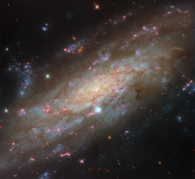

# Preview of potm2604a: "Starry spiral in a familiar neighbourhood"
[https://esahubble.org/images/potm2604a/](https://esahubble.org/images/potm2604a/)

In this ESA/Hubble Picture of the Month, a spiral galaxy glittering with star clusters is the centre of attention. NGC 3137 is located 53 million light-years away in the constellation Antlia (The Air Pump). As a nearby spiral galaxy, this target offers astronomers an excellent opportunity to study the cycle of stellar birth and death, as well as giving researchers a glimpse of a galactic system similar to our own. NGC 3137 is of particular interest to astronomers because it travels through space with a group of galaxies that is thought to be similar to the Local Group, the galaxy group that contains the Milky Way. Similar to the Local Group, the NGC 3175 group contains two large spiral galaxies: NGC 3137 and NGC 3175, which Hubble has also observed. In the Local Group, the largest members are the Milky Way galaxy and Andromeda, another spiral galaxy. In addition to two large spiral galaxies, both groups also contain a number of smaller dwarf galaxies, although it’s not yet known how many of these tiny companions the NGC 3175 group has; researchers have found more than 500 dwarf galaxy candidates. By studying this nearby galaxy group, astronomers can learn about the dynamics of our own galactic home. NGC 3137 is revealed in fantastic detail by Hubble. This image is crafted from observations in six different colour bands, creating a view that highlights several facets of this beautiful spiral. The galaxy’s centre, which is encircled by a network of fine, dusty clouds, hosts a black hole estimated to be 60 million times more massive than the Sun. NGC 3137 is highly inclined from our point of view, giving a unique perspective on its loose, feathery spiral structure. A couple of photobombing Milky Way stars and a smattering of far more distant background galaxies complete the image. As stunning as each of these features may be, it’s the galaxy’s brilliant star clusters that steal the show. The galaxy is peppered with dense clusters of bright blue stars and glowing red gas clouds, which signal the presence of hot, young stars still encased in their birth nebulae. Unsurprisingly, these star clusters are exactly what has drawn Hubble’s keen eye. Researchers are using Hubble to carry out an observing programme (#17502; PI: D. Thilker) focusing on star clusters in 55 nearby galaxies. The data collected will help astronomers identify star clusters and the glowing nebulae that surround them, providing a way to measure the ages of stars in galaxies like NGC 3137. These observations give an in-depth view of stellar life in spiral galaxies, from the young stars still in the process of forming to the ancient stellar populations that grew up in the early years of their galactic hosts. The PHANGS-HST programme for which these observations were taken is part of a larger effort by some of the most powerful observatories on (and around) Earth. Hubble contributes greatly to this massive undertaking, which combines data from the NASA/ESA/CSA James Webb Space Telescope and the Atacama Large Millimetre/submillimetre Array (ALMA). Together, Hubble’s powerful optical and ultraviolet capabilities, Webb’s sensitive infrared eyes, and ALMA’s broad network of radio dishes bring us an unmatched view of star formation in the local Universe. [Image Description: A spiral galaxy seen close up and tilted at an angle, so that its disc fills the view from corner to corner. Its disc is yellow near to the centre and pale blue farther out, showing cooler and hotter stars, respectively. Thin brown clouds of dust, glowing pink spots of star formation, and sparkling blue patches filled with star clusters swirl through the galaxy. Behind it, small orange dots are very distant galaxies.] Links  Image on ESA website Pan video: NGC 3137 